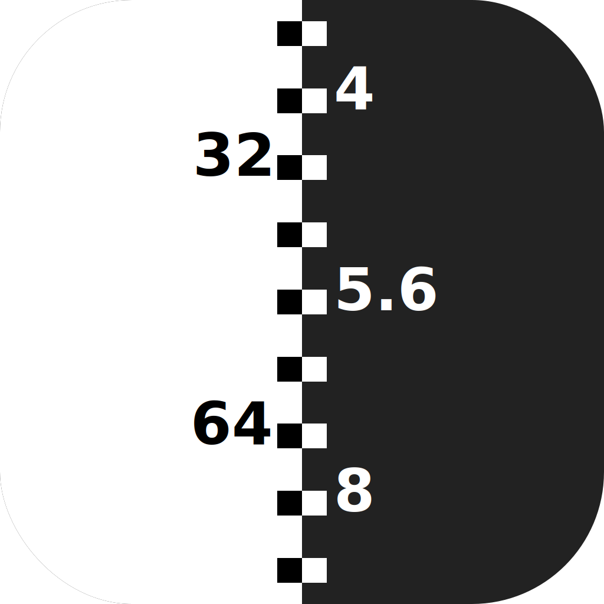
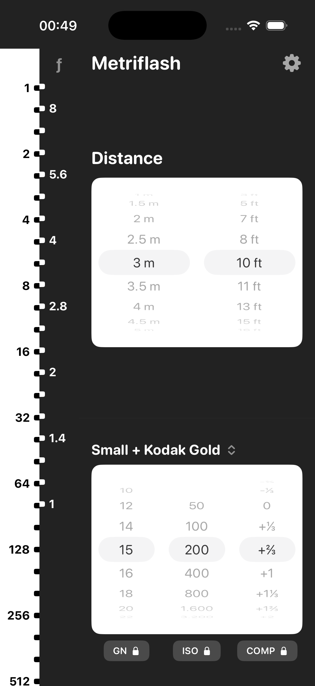
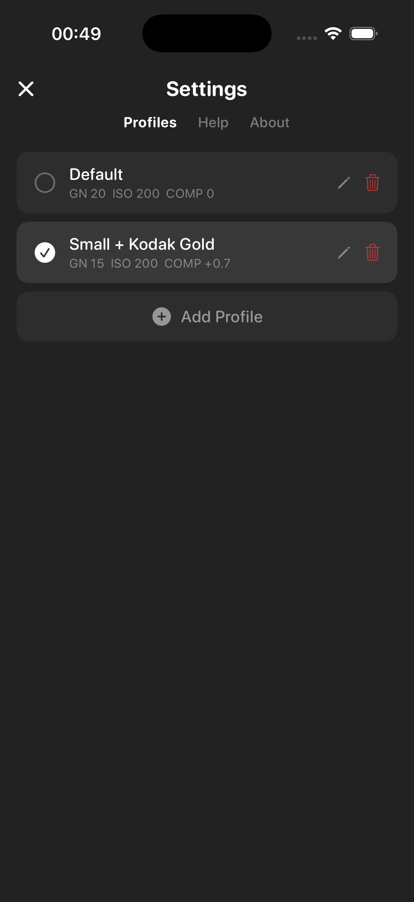

  

# Metriflash

**Quick-reference flash calculator for manual photography.**

Metriflash is an offline iOS app that instantly shows which aperture to use at every flash power level. Set your flash's Guide Number, your film ISO, and the distance to your subject — the two sliding scales do the rest. No internet required, no data collected, no ads.

## Features

- Dual sliding scales — flash power on the left, matching aperture on the right, lined up so you can read off any combination at a glance
- Distance picker in meters and feet (synced)
- 1/3-stop compensation dial
- Profiles — save GN + ISO + compensation combos for different flashes or film stocks
- Lock any setting to prevent accidental changes
- Works 100% offline — zero network requests

## FAQ

How do I use this app?

Set your flash's Guide Number (GN), your film or camera ISO, and the distance to your subject. The two scale bars on the left will show you which aperture (f-stop) to use at each power level on your flash.

  

What are the two bars on the left?

The left bar (white) shows flash power fractions — if it says 16, that means 1/16 of full power. 1 is full blast, 128 is a tiny pop. The right bar (marked ƒ) shows aperture — if it says 5.6, that means ƒ/5.6 on your lens. The two bars slide against each other so that matching pairs line up: the aperture next to a power level is the one you should dial in.

How do I set the distance?

Use the Distance picker at the top right. Scroll to pick meters or feet — they stay in sync. Measure or estimate the distance from your flash to your subject. A tape measure works, or just pace it out — one big step is roughly a meter.

What are profiles for?

Each profile saves a GN + ISO + compensation combo. If you have multiple flashes or shoot different film stocks, make a profile for each so you can switch instantly instead of dialing everything in again.

  

What does locking a setting do?

When you lock GN, ISO, or COMP, two things happen: you can't accidentally change it by scrolling, and it won't get overwritten when you save to a profile. Handy if you want to keep your ISO fixed while experimenting with different flashes.

What's GN (Guide Number)?

It's a single number that describes how powerful your flash is. A bigger GN means more light. It's usually printed on the flash itself, in the manual, or on the manufacturer's website. Most small flashes are around 10–20, big speedlights 30–60.

How do I find my flash's GN?

Check the flash body, its box, or google "[your flash model] guide number." The GN is usually given for ISO 100 in meters. If it says something like "GN 36 (m, ISO 100)" just enter 36. If it's in feet, divide by 3.3 to get meters.

What's ISO?

ISO is the sensitivity of your film (or sensor). Set it to match whatever film you've loaded — it's printed on the box and the canister. Kodak Gold is 200, Portra comes in 160/400/800, most black-and-white is 400. Higher ISO means the film needs less light, so your flash reaches further or you can stop down more.

What's COMP (compensation)?

It's a manual tweak in 1/3-stop increments. If your shots come out too bright, dial it down (e.g. -2/3). Too dark? Dial it up (+1/3). Think of it as a "fudge factor" — start at 0 and adjust based on your results.

How is this all calculated?

The classic flash formula: Aperture = GN × √(ISO ÷ 100) × √(power fraction) ÷ distance. The app computes this for every power level at once and lines up the matching aperture on the scale. Compensation is applied as a stop multiplier on top.

## Privacy

Metriflash collects **zero data**. No analytics, no network requests, no third-party SDKs. Everything runs locally on your device.

- [Privacy Policy](PRIVACY_POLICY.md)
- [Terms of Service](TERMS_OF_SERVICE.md)

## Issues

Found a bug or have an idea?

- [Report a bug](https://github.com/slntopp/metriflash-community/issues/new?template=bug_report.yml)
- [Request a feature](https://github.com/slntopp/metriflash-community/issues/new?template=feature_request.yml)

## Contact

**Email:** info@slnt-opp.xyz

---

Made by Mikita Iwanowski
